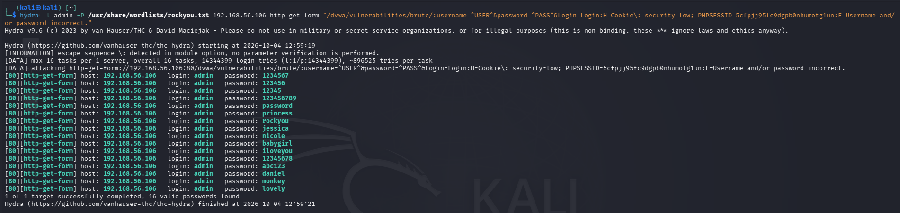
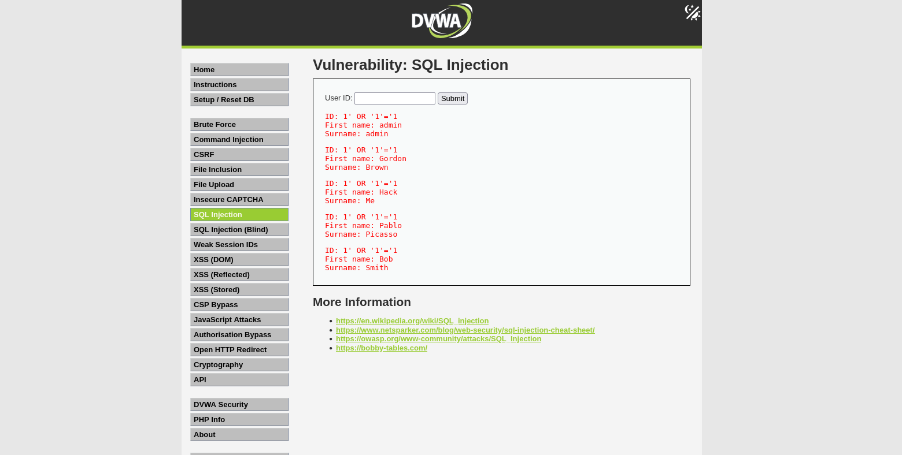
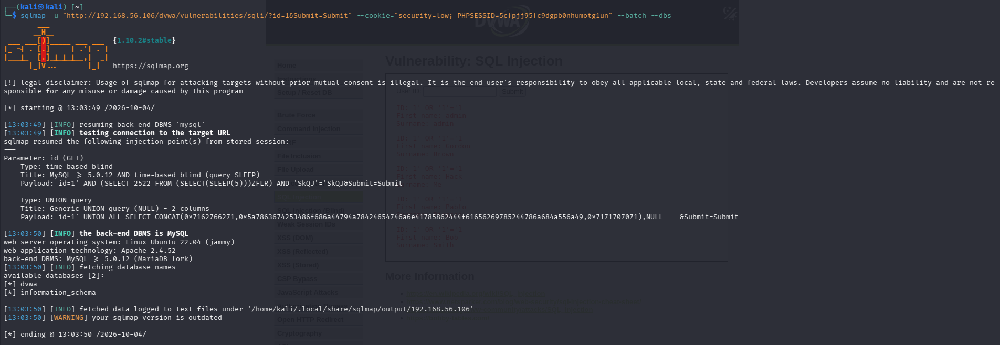
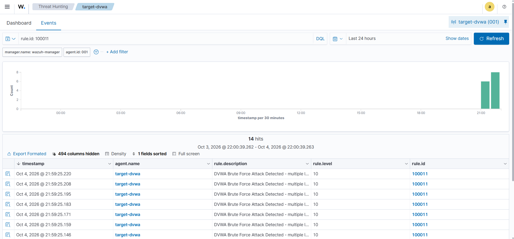
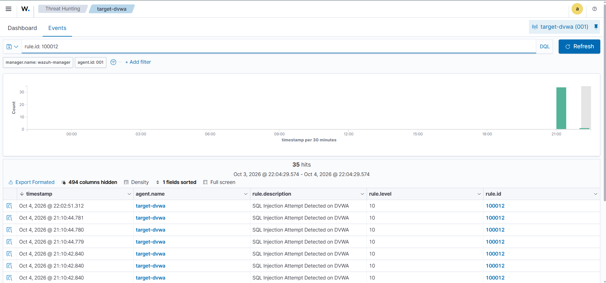
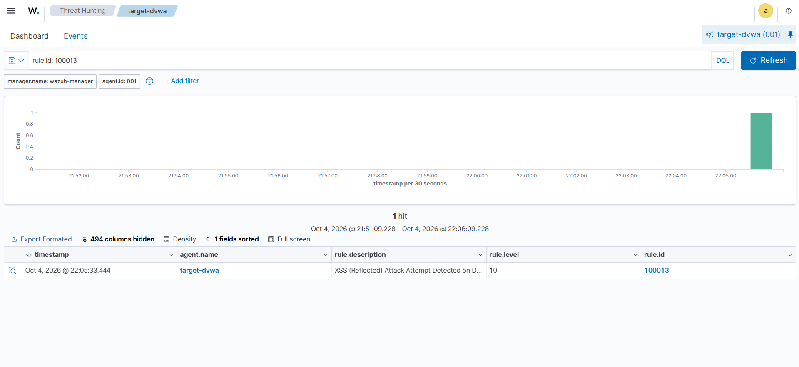

# DVWA + Wazuh Detection Lab

A small home lab where I set up a SIEM (Wazuh) to detect attacks I launched myself from Kali Linux against a deliberately vulnerable web app (DVWA). Built this to get hands-on with the full attack → log → detect → MITRE-map workflow before applying for SOC Analyst roles and a Master's in Cybersecurity.

## Why I built this

Reading about brute force or SQL injection is one thing. Actually standing up a SIEM, writing detection rules that fire correctly, and watching your own attack show up as an alert is a completely different kind of understanding. This lab walks through that whole loop.

## Architecture

Three VirtualBox VMs on an isolated host-only network (192.168.56.0/24):

| VM | Role | IP |
|---|---|---|
| kali-linux | Attacker | 192.168.56.107 |
| target-dvwa | Vulnerable web app (Ubuntu + Apache + MariaDB + DVWA) | 192.168.56.106 |
| wazuh-manager | SIEM (Wazuh indexer + manager + dashboard, all-in-one) | 192.168.56.105 |

The Wazuh agent on target-dvwa ships Apache access/error logs to the manager, which runs both default and custom detection rules against them.

## Attacks performed

### 1. Brute Force (Hydra) — MITRE T1110
Used Hydra against DVWA's login form to brute-force credentials from rockyou.txt.

```
hydra -l admin -P /usr/share/wordlists/rockyou.txt 192.168.56.106 http-get-form \
"/dvwa/vulnerabilities/brute/:username=^USER^&password=^PASS^&Login=Login:H=Cookie\: security=low; PHPSESSID=<session>:F=Username and/or password incorrect."
```

Result: recovered `admin:password` in under 2 seconds.



### 2. SQL Injection — MITRE T1190
Manual injection (`1' OR '1'='1`) on the SQLi page dumped all 5 user records instead of 1. Followed up with sqlmap to automate enumeration:

```
sqlmap -u "http://192.168.56.106/dvwa/vulnerabilities/sqli/?id=1&Submit=Submit" \
--cookie="security=low; PHPSESSID=<session>" --batch --dbs
```

sqlmap confirmed a time-based blind and UNION-based injection point and enumerated the backend databases.




### 3. Reflected XSS — MITRE T1059.007
```
http://192.168.56.106/dvwa/vulnerabilities/xss_r/?name=<script>alert('XSS')</script>
```
Confirmed the app reflects unsanitized input back into the page.


## Detection rules

DVWA always returns HTTP 200 even on failed logins or injection attempts, so Wazuh's default rules don't catch any of this out of the box. I wrote three custom rules (`rules/local_rules.xml`):

- **100010 / 100011** — flags repeated requests to the brute-force login page from the same source IP within 60 seconds (6+ hits)
- **100012** — regex match for SQL injection patterns (`'`, `OR`, `UNION`, `SELECT`, `--`) on the SQLi endpoint
- **100013** — flags `<script>` payloads reaching the reflected XSS endpoint

Each rule is mapped to its MITRE ATT&CK technique so alerts show up tagged correctly in the dashboard.

| Attack | Wazuh Rule ID | Alerts fired | MITRE Technique |
|---|---|---|---|
| Brute Force | 100011 | 6 | T1110 |
| SQL Injection | 100012 | 34 | T1190 |
| Reflected XSS | 100013 | confirmed | T1059.007 |





## Biggest challenge: a network bug that wasn't VirtualBox's fault

Spent a long time debugging why Kali couldn't reach the other VMs at all — ARP worked (`arping` got replies) but ping/TCP didn't, even from the host itself. Went through the usual suspects: recreated the VirtualBox host-only network, disabled Windows Firewall, disabled Hyper-V/Virtual Machine Platform, switched the NIC driver to virtio-net. None of it fixed it.

Turned out `tcpdump` on Kali's own interface showed 0 packets leaving the box at all — which meant it wasn't a VirtualBox problem, it was local. Checked `nft list ruleset` and found a leftover **Cloudflare WARP** nftables table with a default-drop policy on the output chain and no explicit ICMP allow rule. Disabling `warp-svc` fixed it instantly.

Lesson: when ARP works but nothing above L2 does, stop looking at the virtual switch and check the guest's own firewall/nftables rules first.

## Setup summary

1. VirtualBox host-only network, 3 VMs (Ubuntu 22.04 x2, Kali 2026.1)
2. Wazuh all-in-one install (`wazuh-install.sh -a`) on wazuh-manager
3. DVWA on Apache + MariaDB (not MySQL 8 — DVWA's schema isn't MySQL-8-compatible)
4. Wazuh agent 4.9.2 enrolled on target-dvwa (must match manager's major.minor version)
5. Security level set to Low on DVWA for the vulnerable code paths
6. Custom rules added to `/var/ossec/etc/rules/local_rules.xml` on the manager

## What I'd add next

- Automated response (block the source IP after N failed brute-force attempts)
- File Integrity Monitoring on DVWA's config files
- A second agent on wazuh-manager itself for self-monitoring
