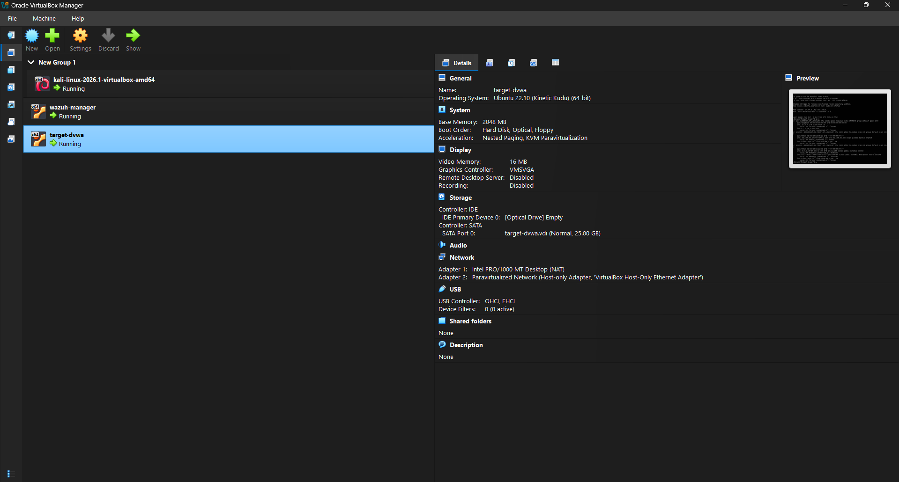
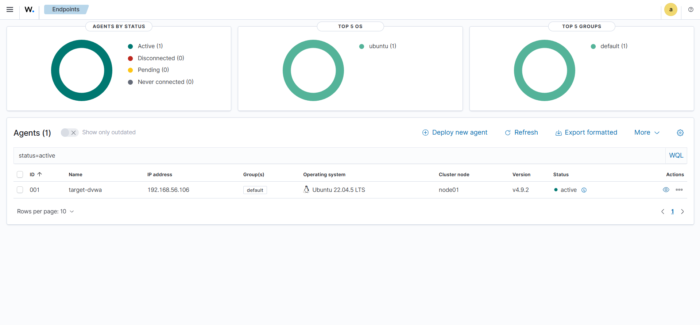
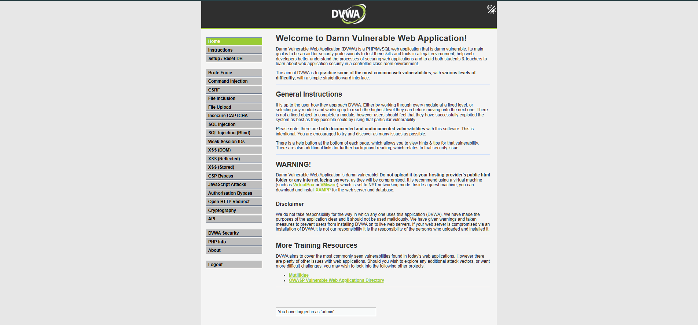
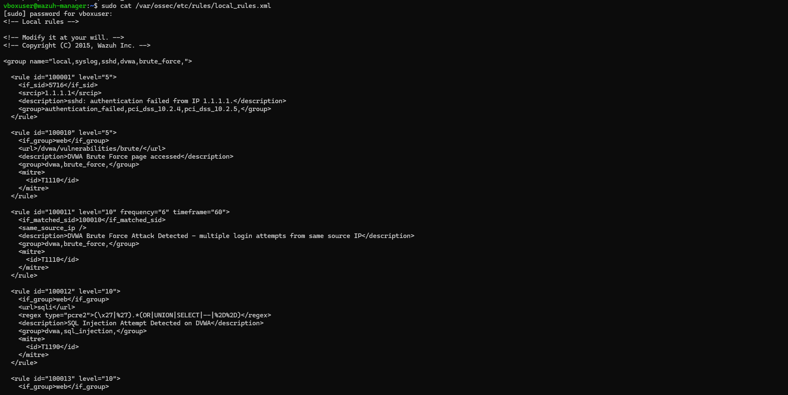
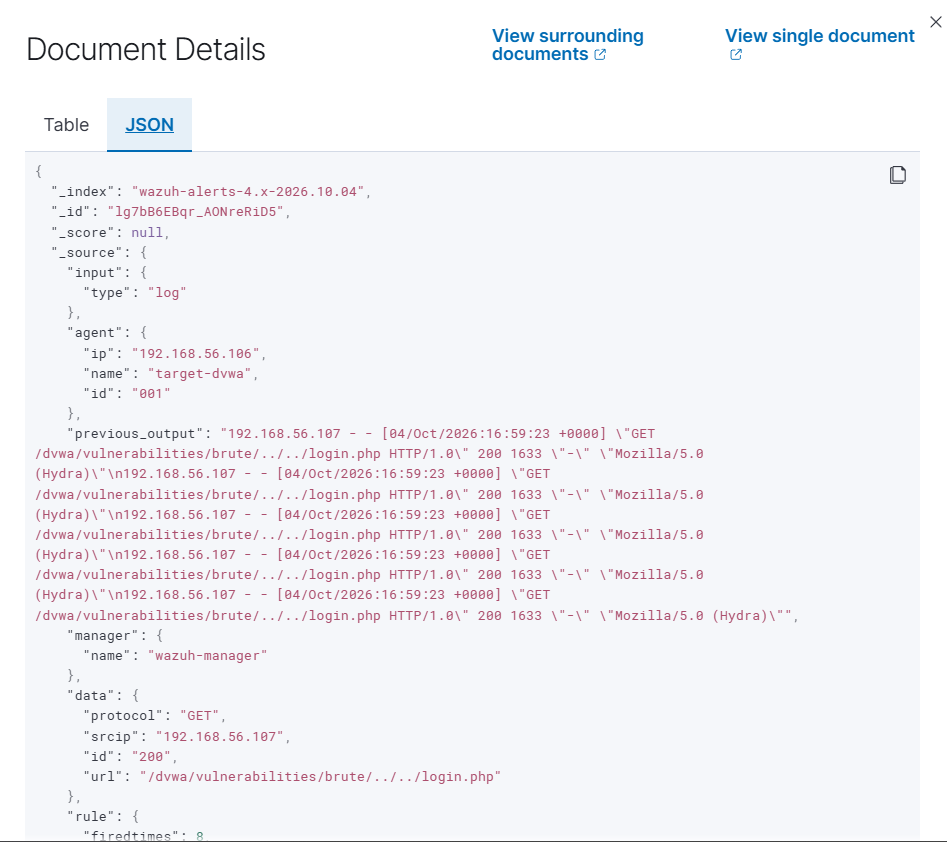
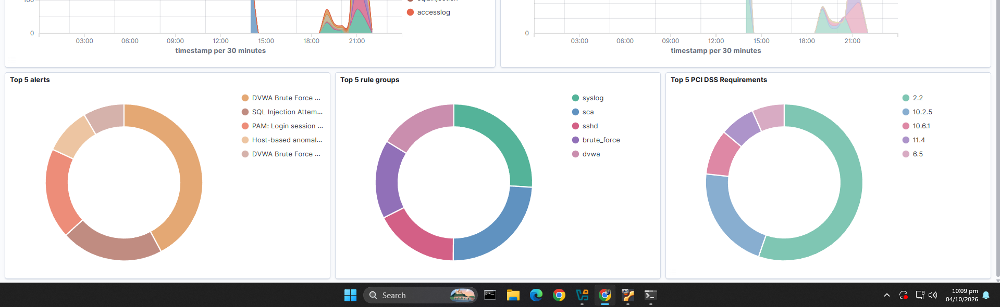

# SIEM Detection Lab: Detecting Web Attacks with Wazuh and DVWA

A home lab in which I attack a deliberately vulnerable web application (DVWA) from Kali Linux and detect those attacks with a Wazuh SIEM using **custom detection rules mapped to MITRE ATT&CK**.

Wazuh's default rules detected none of the attacks, so the core of this project is detection engineering: working out why the default rules missed them, writing rules that catch them, and validating the alerts.

## Key results

| Attack | Tool | MITRE ATT&CK | Default Wazuh rules | Custom rule | Alerts observed |
|---|---|---|---|---|---|
| Brute force | Hydra | T1110 (Credential Access) | No detection | 100010 / 100011 | 6 |
| SQL injection | Manual + sqlmap | T1190 (Initial Access) | No detection | 100012 | 34 |
| Reflected XSS | Manual payload | T1059.007 (Execution) | No detection | 100013 | [add count from dashboard] |

## Table of contents

1. [Objective](#objective)
2. [Ethical use and scope](#ethical-use-and-scope)
3. [Architecture](#architecture)
4. [Lab setup](#lab-setup)
5. [Attacks performed](#attacks-performed)
6. [Detection engineering](#detection-engineering)
7. [MITRE ATT&CK mapping](#mitre-attck-mapping)
8. [Limitations](#limitations)
9. [Defensive recommendations](#defensive-recommendations)
10. [Troubleshooting case study](#troubleshooting-case-study)
11. [Skills demonstrated](#skills-demonstrated)
12. [Next steps](#next-steps)
13. [Repository structure](#repository-structure)

## Objective

To get hands-on experience with the full monitoring loop: **attack, log, detect, map to MITRE ATT&CK**. Reading about brute force or SQL injection is different from standing up a SIEM, writing rules that fire correctly, and watching your own attack appear as an alert.

## Ethical use and scope

- All attacks were run inside an isolated VirtualBox host-only network against a machine I own.
- DVWA is intentionally vulnerable. Never expose it to the internet.
- The commands in this repository are for learning in a lab. Do not run them against systems you do not own or have written permission to test.
- Session cookies in the commands are placeholders.

## Architecture

Three VirtualBox VMs on an isolated host-only network (192.168.56.0/24):

| VM | Role | IP |
|---|---|---|
| kali-linux | Attacker | 192.168.56.107 |
| target-dvwa | Vulnerable web app (Ubuntu + Apache + MariaDB + DVWA) | 192.168.56.106 |
| wazuh-manager | SIEM (Wazuh indexer + manager + dashboard, all-in-one) | 192.168.56.105 |

The Wazuh agent on `target-dvwa` ships Apache access and error logs to the manager, which runs the default and custom rules against them.





## Lab setup

1. Create a VirtualBox host-only network and three VMs (Ubuntu 22.04 x2, Kali 2026.1).
2. Install Wazuh all-in-one on `wazuh-manager`: `wazuh-install.sh -a`. Manager version: [add version].
3. On `target-dvwa`, install Apache and MariaDB, then DVWA. Use MariaDB, not MySQL 8, because DVWA's schema is not compatible with MySQL 8.
4. Enrol the Wazuh agent (4.9.2) on `target-dvwa`. The agent's major.minor version must match the manager's.
5. Set the DVWA security level to **Low** so the vulnerable code paths are active.
6. Add the custom rules in `rules/local_rules.xml` to `/var/ossec/etc/rules/local_rules.xml` on the manager and restart it.

## Attacks performed

### 1. Brute force (Hydra) - T1110

Hydra against DVWA's login form with `rockyou.txt`:

```bash
hydra -l admin -P /usr/share/wordlists/rockyou.txt 192.168.56.106 http-get-form \
"/dvwa/vulnerabilities/brute/:username=^USER^&password=^PASS^&Login=Login:H=Cookie\: security=low; PHPSESSID=<session>:F=Username and/or password incorrect."
```

Hydra found `admin:password`, which are DVWA's default credentials.


### 2. SQL injection - T1190

Manual injection (`1' OR '1'='1`) on the SQLi page returned all 5 user records instead of 1. I then used sqlmap to automate the enumeration:

```bash
sqlmap -u "http://192.168.56.106/dvwa/vulnerabilities/sqli/?id=1&Submit=Submit" \
--cookie="security=low; PHPSESSID=<session>" --batch --dbs
```

sqlmap confirmed a time-based blind and a UNION-based injection point and listed the backend databases.


### 3. Reflected XSS - T1059.007

```
http://192.168.56.106/dvwa/vulnerabilities/xss_r/?name=<script>alert('XSS')</script>
```

The application reflected the unsanitised input back into the page.


## Detection engineering

### Why the default rules missed the attacks

DVWA returns HTTP 200 even for failed logins and injection attempts. The default Wazuh rules key off status codes and known signatures, so they raised nothing. Detection had to be built on request content and request frequency instead.

### Custom rules

Three custom rules in `rules/local_rules.xml`:

| Rule ID | Detects | Logic | MITRE |
|---|---|---|---|
| 100010 / 100011 | Brute force | 6 or more requests to the login page from one source IP within 60 seconds (frequency-based) | T1110 |
| 100012 | SQL injection | Regex for SQLi patterns (`'`, `OR`, `UNION`, `SELECT`, `--`) on the SQLi endpoint | T1190 |
| 100013 | Reflected XSS | `<script>` payload reaching the reflected XSS endpoint | T1059.007 |

```xml
<!-- Paste the exact rules from local_rules.xml here -->
```



### Results

All three rules fired in real time on the Wazuh dashboard.







## MITRE ATT&CK mapping

| Technique | Name | Tactic | Evidence in this lab |
|---|---|---|---|
| T1110 | Brute Force | Credential Access | Hydra run, rules 100010 / 100011 |
| T1190 | Exploit Public-Facing Application | Initial Access | Manual SQLi and sqlmap, rule 100012 |
| T1059.007 | Command and Scripting Interpreter: JavaScript | Execution | Reflected XSS payload, rule 100013 |

Note: ATT&CK has no technique that matches reflected XSS exactly. T1059.007 is the closest fit because the payload executes JavaScript in the victim's browser.

## Limitations

- **Pattern matching is easy to evade.** The SQLi and XSS rules match fixed strings. Encoding, case changes or comment tricks can bypass them.
- **False positives are likely.** Patterns such as `'`, `OR` and `SELECT` can appear in legitimate input. I did not measure the false-positive rate against normal traffic in this lab.
- **Rules are tied to specific DVWA endpoints.** They would need adapting for another application.
- **The brute-force threshold (6 hits in 60 seconds) was chosen for this lab.** A real environment needs a threshold tuned to its normal login behaviour.
- **Tested only at DVWA security level Low** and only against attacks I launched myself.
- **Detection only.** Nothing blocks the attacker automatically.

## Defensive recommendations

| Vulnerability | Fix |
|---|---|
| Brute force | Rate limiting, account lockout after repeated failures, CAPTCHA or multi-factor authentication |
| SQL injection | Parameterised queries (prepared statements), input validation |
| Reflected XSS | Output encoding, Content Security Policy |

## Troubleshooting case study

**Symptom:** Kali could not reach the other VMs. ARP worked (`arping` got replies), but ping and TCP did not, even from the host.

**What I ruled out:**
- Recreated the VirtualBox host-only network
- Disabled Windows Firewall
- Disabled Hyper-V and Virtual Machine Platform
- Switched the NIC driver to virtio-net

None of these helped.

**Root cause:** `tcpdump` on Kali's own interface showed 0 packets leaving the machine, so the fault was local, not in VirtualBox. `nft list ruleset` showed a leftover **Cloudflare WARP** nftables table with a default-drop policy on the output chain and no explicit ICMP allow rule.

**Fix:** disabling `warp-svc` restored connectivity immediately.

**Lesson:** when ARP works but nothing above layer 2 does, check the guest's own firewall and nftables rules before the virtual switch.

## Skills demonstrated

SIEM deployment and management (Wazuh), custom detection rule development (XML, regex), MITRE ATT&CK mapping, offensive tooling (Hydra, sqlmap), Linux administration, virtualisation and network configuration, network troubleshooting (tcpdump, nftables), technical documentation.

## Next steps

- Automated response: block the source IP after repeated failed logins
- File Integrity Monitoring on DVWA's configuration files
- A second agent on the Wazuh manager for self-monitoring
- Measure false positives against normal web traffic and tune the rules

## Repository structure

```
.
├── README.md
├── rules/
│   └── local_rules.xml
└── screenshots/
```

## License

[Add a licence, for example MIT]
